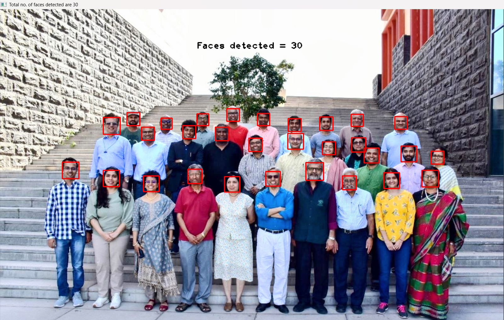
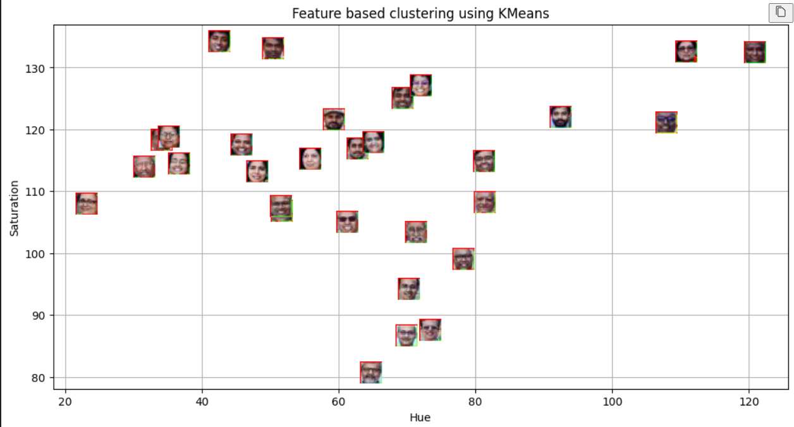
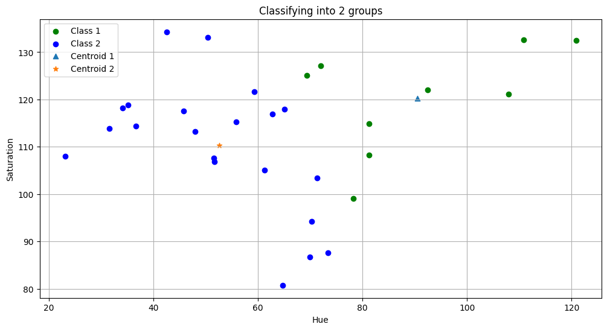
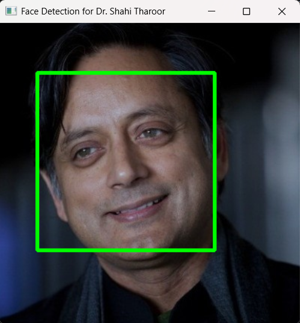
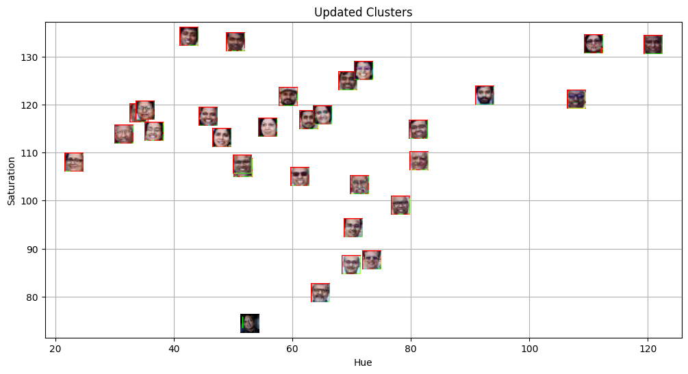
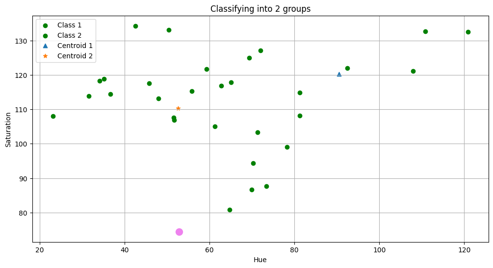

# The Aim of this lab was to used KMeans clustering and open CV to detect a new face and classify it into one of two categories   

## First we used OpenCV to put a bounding boxes over the faces of our "Test Set"

## Then We used two eatures namely the hue and saturation to plot all the faces into a 2D cartesian plane

## Now we draw a bounding box over Dr. Shashi Tharoor's face. 

## Now, we use Kmeans clustering to predict in which class should Dr. Shashi Tharoor Belong to 

